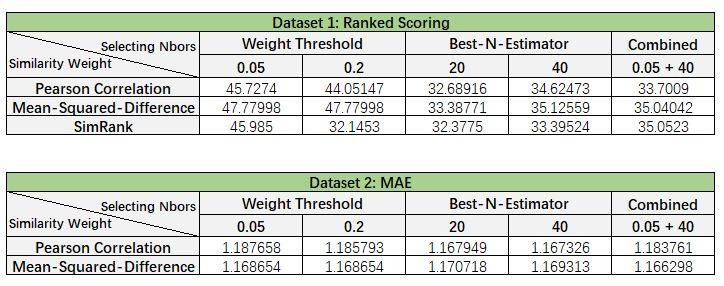

# Project 4: Collaborative Filtering

### [Project Description](doc/project4_desc.md)

Term: Spring 2018

+ Team # 4
+ Projec title: Collaborative Filtering
+ Team members
	+ Guo, Du
	+ Tong, Yu
	+ Wen, Lan
	+ Yan, Xiuruo
	+ Zha, Yuhan
+ Project summary: In this project, we use memory-based algorithm and model-based algorithm to do collaborative filtering.
	+ For memory-based algorithm: We use 1) Pearson correlation, Mean-Square-Difference and SimRank with no variance weighting to settle down the weight; 2) Weight Threshold, Best-n-estimator and Combined method to select the neighbors; 3) Z-Score to make predictions; 4) Ranked-Scoring (Dataset 1) and MAE (Dataset 2) to evaluate the results.
	+ For model-based algorithm: We use 1) EM algrithm to find gamma and mu; 2) estimate scores for movie data; 2) cross valuation to choose the best number of cluster; 3) evaluate the result with MAE.
	+ Following are the results of different combinations of memory based algorithm:
	
	
**Contribution statement**: ([default](doc/a_note_on_contributions.md)) All team members approve our work presented in this GitHub repository including this contributions statement.
+ Guo, Du: Presentaion PowerPoint, SimRank Algorithm, Refine combination of Weight Threshold and Best-n-estimator.  
+ Tong, Yu: Cluster model predictions, SimRank Algorithm  
+ Wen, Lan: Mean-Square-Difference, Best-n-estimator, Z-Score prediction (matrix form), Ranked Scoring & MAE evaluation
+ Yan, Xiuruo:  transform data, Main.rmd, EM algrithm in Cluster model, MAE evaluation, MemoryBased.R  
+ Zha, Yuhan: Pearson Correlation, Weight Threshold, Combination of Weight Threshold and Best-N-Estimator, Ranked Scoring evaluation   

Following [suggestions](http://nicercode.github.io/blog/2013-04-05-projects/) by [RICH FITZJOHN](http://nicercode.github.io/about/#Team) (@richfitz). This folder is orgarnized as follows.

```
proj/
├── lib/
├── data/
├── doc/
├── figs/
└── output/
```

Please see each subfolder for a README file.
